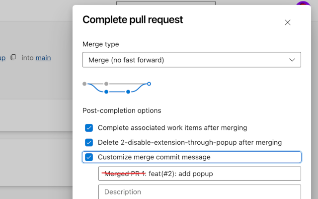

# Complete PR without Merged

Chrome extension that waits until the "Enable automatic completion" or "Complete pull request" dialog appears
on the pull request page of [dev.azure.com](https://dev.azure.com/).
It then enables the "Customize merge commit" option and removes the "Merged PR ...:" prefix from the title.

## Screenshot

## Development

1. Clone this repo
1. Install packages: `npm ci`
1. Build extension: `npm run build`
1. Go to chrome extensions [chrome://extensions](chrome://extensions)
1. Enable developer mode
1. Click on load unpacked extension and select the folder `dist`

## License

MIT
