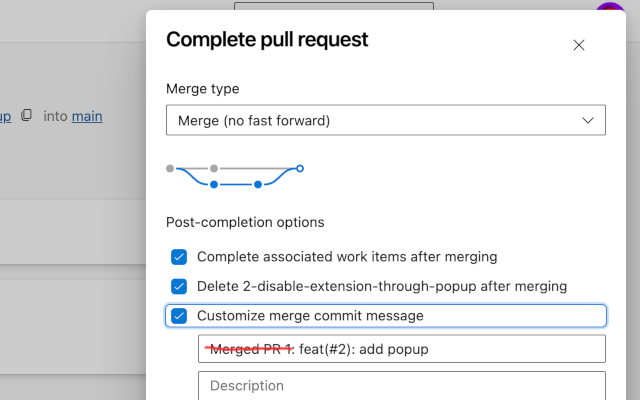

# Complete PR without Merged

Browser extension that waits until the "Enable automatic completion" or "Complete pull request" dialog appears
on the pull request page of [dev.azure.com](https://dev.azure.com/).
It then enables the "Customize merge commit" option and removes the "Merged PR ...:" prefix from the title.

To use the extension with on-premise or `*.visualstudio.com` Azure DevOps instances, click the extension icon on a pull request page of that host. A permission dialog will appear—click **"Allow"** to grant the extension access to that instance.

Since [2024-03-05](https://learn.microsoft.com/en-us/azure/devops/release-notes/2026/sprint-270-update#new-repository-setting-for-pull-request-id-in-commit-messages) you can disable the [include PR ID in commit message setting](https://learn.microsoft.com/en-us/azure/devops/repos/git/repository-settings?view=azure-devops&tabs=browser#include-pr-id-in-commit-message) of the Azure DevOps repository settings.

## Screenshot

## Install

- Google Chrome: Go to [Chrome Web Store](https://chromewebstore.google.com/detail/complete-pr-without-merge/djmhpijahmaipeldgjhmibgoppbapmja) and install.
- Mozilla Firefox: Go to [Add-ons for Firefox](https://addons.mozilla.org/de/firefox/addon/complete-pr-without-merged/) and install.

## Development

### Chrome

1. Clone this repo
1. Use node 24.15.0 or higher
1. Install packages: `npm ci`
1. Build extension: `npm run build:chrome`
1. Go to chrome extensions [chrome://extensions](chrome://extensions)
1. Enable developer mode
1. Click on load unpacked extension and select the folder `dist/chrome`

### Firefox

1. Clone this repo
1. Use node 24.15.0 or higher
1. Install packages: `npm ci`
1. Build add-on: `npm run build:firefox`
1. Go to add-on page [about:debugging#/runtime/this-firefox](about:debugging#/runtime/this-firefox)
1. Click on temporary add-on install button and select the folder `dist/firefox`

### Packages

The packages `web-ext-artifacts/*.zip` for chrome and firefox are built by `npm start`.

## License

MIT
